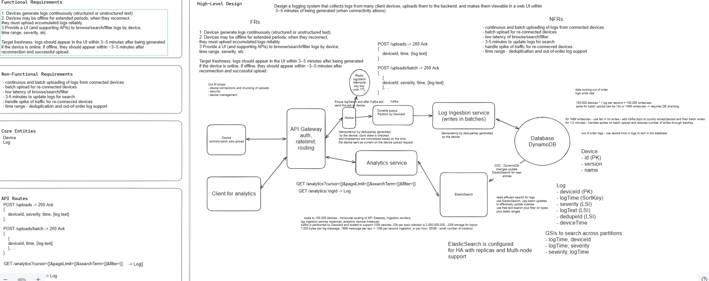

# Distributed Logging System --- Staff-Level System Design

> **Design goal:** Collect logs from many client devices, reliably
> handle online and offline uploads, store them efficiently, and make
> them searchable in a web UI with a target freshness of roughly **3--5
> minutes** when connectivity allows.

------------------------------------------------------------------------

## Original System Design



> The diagram above is the original design used as the basis for the detailed discussion below.

---

## 1. Requirements

### Functional Requirements

1.  **Continuous log generation**
    -   Devices continuously generate logs.
    -   Logs may be structured or unstructured text.
2.  **Offline support**
    -   Devices may remain offline for extended periods.
    -   Logs must be buffered locally while offline.
    -   When connectivity is restored, accumulated logs must be uploaded
        reliably.
3.  **Search / Browse**
    -   Provide APIs and a UI to:
        -   Browse logs
        -   Search logs
        -   Filter by device
        -   Filter by time range
        -   Filter by severity
4.  **Freshness**
    -   **Online device:** generated log should become searchable within
        about **3--5 minutes**.
    -   **Offline device:** after reconnection and successful upload,
        logs should become searchable within the intended **3--5
        minute** target, subject to backlog size.

### Non-Functional Requirements

-   Continuous and batch upload for connected/reconnected devices.
-   Low latency for browse/search/filter operations.
-   Handle traffic spikes when many devices reconnect simultaneously.
-   Durable log ingestion.
-   Horizontal scalability.
-   At-least-once delivery is acceptable.
-   Duplicate handling / idempotency.
-   Backpressure support.
-   Time-range queries.
-   Out-of-order log support.
-   High availability for the search tier.
-   Isolation between ingestion and query paths.
-   Cost-efficient storage.

### Core Entities

-   `Device`
-   `Log`

------------------------------------------------------------------------

## 2. API Surface

### Upload a single log

``` http
POST /uploads
```

``` json
{
  "deviceId": "device-123",
  "severity": "ERROR",
  "time": "event-time",
  "logText": "..."
}
```

Response:

``` text
200 ACK
```

### Upload a batch

``` http
POST /uploads/batch
```

``` json
[
  {
    "deviceId": "device-123",
    "severity": "ERROR",
    "time": "event-time",
    "logText": "..."
  }
]
```

Response:

``` text
200 ACK
```

### Search / browse logs

``` http
GET /analytics?cursor={}&pageLimit={}&searchTerm={}&filter={}
```

### Fetch one log

``` http
GET /analytics/{logId}
```

------------------------------------------------------------------------

## 3. High-Level Architecture

``` text
                       DEVICE
              +-----------------------+
              | Application           |
              |                       |
              | Local Log Collector   |
              |                       |
              | Persistent Buffer     |
              |                       |
              | Upload Manager        |
              +-----------+-----------+
                          |
                   batched/compressed
                      HTTPS/gRPC
                          |
                          v
              +-----------------------+
              | API Gateway           |
              |                       |
              | Authentication        |
              | Rate limiting         |
              | Routing               |
              | Request size limits   |
              +-----------+-----------+
                          |
                          v
              +-----------------------+
              | Upload Worker         |
              |                       |
              | Validation            |
              | Idempotency checks    |
              +-----------+-----------+
                          |
                          v
              +-----------------------+
              | Kafka                 |
              | Durable Queue         |
              |                       |
              | Partitioned by        |
              | hashed deviceId       |
              +-----------+-----------+
                          |
                          v
              +-----------------------+
              | Log Ingestion Service |
              |                       |
              | Consumer Group        |
              | Batch Writes          |
              +-----------+-----------+
                          |
                          v
              +-----------------------+
              | DynamoDB              |
              | Durable Operational   |
              | Log Store             |
              +-----------+-----------+
                          |
                    CDC / Streams
                          |
                          v
              +-----------------------+
              | Elasticsearch         |
              |                       |
              | Full-text search      |
              | Filters               |
              | Time-range queries    |
              +-----------+-----------+
                          |
                          v
              +-----------------------+
              | Analytics Service     |
              |                       |
              | Query authorization   |
              | Cursor pagination     |
              | Result shaping        |
              +-----------+-----------+
                          |
                          v
                    API Gateway
                          |
                          v
                     Web Client
```

### Important ACK boundary

The backend should ACK a device **only after Kafka has durably accepted
the batch**.

The device can then remove the acknowledged records from its persistent
local buffer.

------------------------------------------------------------------------

## 4. Component Responsibilities

### 4.1 Device / Local Upload Manager

The device continuously collects logs.

A persistent local buffer is required because an in-memory queue is
insufficient:

``` text
Device generates logs
        |
        v
Device goes offline
        |
        v
Logs accumulate
        |
        v
Device restarts
        |
        v
In-memory logs would be lost
```

Therefore use an append-only local file/spool or lightweight durable
store.

Responsibilities:

-   Persist logs locally.
-   Upload bounded batches rather than an entire backlog.
-   Prefer compression for network efficiency.
-   Retain logs until the server ACKs durable acceptance.
-   Retry transient failures.
-   Use exponential backoff + jitter.
-   Maintain a bounded number of requests in flight.

------------------------------------------------------------------------

### 4.2 API Gateway

Responsibilities:

-   Device authentication.
-   Routing.
-   Request-size limits.
-   Per-device rate limiting.
-   Per-tenant rate limiting.
-   Admission control.

If the backend is overloaded:

``` http
429 Too Many Requests
Retry-After: ...
```

The device should back off rather than continuously retry.

------------------------------------------------------------------------

### 4.3 Upload Worker

Responsibilities:

-   Validate incoming batches.
-   Validate timestamps / payload sizes.
-   Generate or validate idempotency information.
-   Produce accepted batches to Kafka.
-   ACK the device only after Kafka durably accepts the data.

------------------------------------------------------------------------

### 4.4 Kafka / Durable Queue

Kafka decouples:

``` text
Device upload throughput
          |
          X
          |
Database / search indexing throughput
```

Instead:

``` text
Devices
   |
   v
Kafka
   |
   +----> downstream consumers process at their own rate
```

Kafka provides:

-   Durable buffering.
-   Burst absorption.
-   Replay.
-   Failure recovery.
-   Consumer-group scaling.

#### Partitioning

Do **not** create one Kafka partition per device.

Instead:

``` text
partition = hash(deviceId) % partitionCount
```

Benefits:

-   Distributes devices across partitions.
-   Preserves useful per-device ordering.
-   Allows horizontal consumer scaling.

------------------------------------------------------------------------

### 4.5 Log Ingestion Service

Consumes Kafka and writes logs to DynamoDB in batches.

Responsibilities:

-   Consumer-group processing.
-   Batch database writes.
-   Retry transient failures.
-   Handle duplicate delivery idempotently.
-   Commit Kafka offsets only after successful processing.

Consumer parallelism is ultimately bounded by Kafka partition count.

------------------------------------------------------------------------

### 4.6 DynamoDB

In the current design, DynamoDB is the **durable operational source of
truth**.

Avoid indexing arbitrary `logText` through DynamoDB secondary indexes.
Full-text search belongs in Elasticsearch.

A safer high-volume key model is:

``` text
PK = deviceId#timeBucket
SK = eventTime#sequenceNumber
```

Example:

``` text
PK = device123#2026-09-28
SK = 10:31:25.123#987654
```

Attributes:

``` text
severity
logText
eventId
eventTime
ingestionTime
sequenceNumber
...
```

Time bucketing prevents an indefinitely hot single-device partition and
makes time-range access natural.

------------------------------------------------------------------------

### 4.7 Elasticsearch

Elasticsearch provides the query capabilities needed by the UI:

-   Full-text search.
-   Device filtering.
-   Severity filtering.
-   Time-range queries.
-   Aggregations.

It is updated asynchronously through DynamoDB CDC / Streams.

Therefore Elasticsearch is **not on the device ACK path**.

If Elasticsearch slows down:

``` text
Device ingestion continues
        |
        v
DynamoDB continues receiving data
        |
        v
CDC/indexing lag increases
```

Search freshness can temporarily degrade without immediately stopping
ingestion.

For HA:

-   Multiple nodes.
-   Replicas.
-   Monitor shard health and indexing pressure.

------------------------------------------------------------------------

### 4.8 Analytics Service

Responsibilities:

-   Query authorization.
-   Search/filter API.
-   Cursor pagination.
-   Result shaping.
-   Tenant/device access enforcement.

Search should primarily query Elasticsearch rather than scan DynamoDB.

------------------------------------------------------------------------

## 5. Data Model

### Device

``` text
Device
------
id          PK
version
name
```

### Log

Conceptually:

``` text
Log
---
deviceId
eventTime
ingestionTime
sequenceNumber
severity
logText
eventId
```

Recommended DynamoDB representation:

``` text
PK = deviceId#timeBucket
SK = eventTime#sequenceNumber
```

------------------------------------------------------------------------

## 6. Delivery Semantics, ACKs and Idempotency

The system uses **at-least-once delivery**.

### Normal flow

``` text
Device
   |
   | Batch 47
   v
Upload Worker
   |
   v
Kafka
   |
   | durable ACK
   v
Upload Worker
   |
   | HTTP 200
   v
Device
   |
   v
Delete acknowledged local records
```

### Lost ACK scenario

``` text
Device -------- Batch 47 --------> Worker
                                     |
                                     v
                                   Kafka
                                     |
                                   stored
                                     |
Worker ----------- ACK ------------> Device
                    X
                network failure
```

The device cannot know whether the request succeeded.

It therefore retries:

``` text
Batch 47
```

This creates a possible duplicate.

Therefore each event needs a deterministic identity.

For example:

``` text
eventId = deviceId + sequenceNumber
```

For batches:

``` text
batchId = deviceId + firstSequence + lastSequence
```

### Redis

Redis may be used for:

``` text
short-lived duplicate suppression
```

but should not be the only source of truth for idempotency.

Why?

-   TTL can expire.
-   Cache can be rebuilt/lost.
-   An old retry may arrive after the Redis entry disappears.

The deterministic event identity allows downstream writes to remain
idempotent.

------------------------------------------------------------------------

## 7. Out-of-Order Logs

Offline devices make arrival order different from event order.

Example:

``` text
08:01   log1 generated
08:02   log2 generated
08:05   log3 generated

        DEVICE OFFLINE

09:00   device reconnects

09:00   current live log generated
09:00   historical logs uploaded
```

Backend arrival order could be:

``` text
09:00 liveLog
08:01 log1
08:02 log2
08:05 log3
```

Therefore store:

### `eventTime`

When the device says the event happened.

Used primarily for user-visible chronological search.

### `ingestionTime`

When the backend received the event.

Useful for:

-   Pipeline debugging.
-   Measuring freshness.
-   Detecting delayed uploads.

### `sequenceNumber`

Useful for:

-   Deterministic per-device ordering.
-   Deduplication.
-   Handling device clock skew.

------------------------------------------------------------------------

## 8. Capacity Estimation

Baseline from the design:

``` text
100,000 devices
× 1 log/sec/device
-------------------
100,000 logs/sec
```

If each log is approximately 1 KB:

``` text
100,000 × 1 KB
≈ 100 MB/sec raw ingress
```

The more interesting case is reconnect traffic.

------------------------------------------------------------------------

# 9. Reconnect Storm Scenario

## Interview Question

> 10,000 devices were offline for 24 hours. They all reconnect at 9 AM.
> Each has 500 MB of logs waiting. Walk through what happens. What
> breaks first, and how does the system protect itself?

### Step 1 --- Quantify the backlog

``` text
10,000 devices × 500 MB
= 5,000,000 MB
≈ 5 TB
```

At 9 AM:

``` text
5 TB historical backlog
+
normal live traffic
```

The system should treat this as a **controlled backlog**, not allow
every device to determine the ingestion rate.

------------------------------------------------------------------------

## 10. Device-Side Protection

A device should **not** upload its entire 500 MB backlog as one request.

Instead:

``` text
500 MB backlog
      |
      v
+-------------+
| Batch 1     |
+-------------+
| Batch 2     |
+-------------+
| Batch 3     |
+-------------+
| ...         |
+-------------+
```

Exact batch size should be configurable.

Benefits:

-   Bounded request size.
-   Individual batch retries.
-   Resume interrupted uploads.
-   Compression.
-   Backpressure.
-   Fairness across devices.

------------------------------------------------------------------------

## 11. Prevent a Reconnect DDoS

Do not allow:

``` text
while (logsRemaining)
    upload();
```

from all 10,000 devices simultaneously.

Use:

-   Per-device limits.
-   Per-tenant limits.
-   Bounded concurrent batches.
-   `429 Too Many Requests`.
-   `Retry-After`.
-   Exponential backoff.
-   Jitter.

### Why jitter matters

Without jitter:

``` text
10,000 devices fail
       |
       v
all retry after 1 second
       |
       v
10,000 simultaneous requests

all fail again
       |
       v
all retry after 2 seconds
```

This creates a retry storm.

With jitter:

``` text
device A -> retry ~1.1 sec
device B -> retry ~1.5 sec
device C -> retry ~1.9 sec
...
```

Retries spread over time.

------------------------------------------------------------------------

## 12. Kafka as the Shock Absorber

Suppose:

``` text
Ingress = 800K logs/sec
Consumers = 500K logs/sec
```

Then:

``` text
Kafka lag grows by ~300K logs/sec
```

temporarily.

That is preferable to allowing the database to collapse.

Without Kafka:

``` text
DynamoDB overloaded
       |
       v
request timeout
       |
       v
devices retry
       |
       v
more traffic
       |
       v
system collapse
```

With Kafka:

``` text
Reconnect burst
      |
      v
Kafka backlog grows
      |
      v
Consumers process at controlled rate
      |
      v
Backlog eventually drains
```

------------------------------------------------------------------------

## 13. What Breaks First?

Do not automatically answer "Kafka."

Potential bottlenecks include:

-   Network ingress.
-   API Gateway / upload workers.
-   Kafka partition throughput.
-   DynamoDB write capacity.
-   CDC throughput.
-   Elasticsearch indexing throughput.

The actual bottleneck should be determined from measured component
capacity.

Elasticsearch is particularly important because indexing is heavier than
appending a record to Kafka.

The asynchronous path:

``` text
Kafka
  |
  v
DynamoDB
  |
  v
CDC
  |
  v
Elasticsearch
```

allows Elasticsearch to fall behind without immediately breaking
ingestion.

------------------------------------------------------------------------

## 14. Protect Live Logs from Historical Backfill

Suppose 5 TB of old logs are being replayed while a current log arrives:

``` text
ERROR: Payment service crashed
```

That live error should not wait behind millions of historical records.

Otherwise the 3--5 minute freshness SLA for online devices is violated.

Conceptually separate:

``` text
                    Ingestion
                        |
             +----------+----------+
             |                     |
             v                     v
        LIVE LOGS             BACKFILL LOGS
        high priority          controlled
             |                     |
             +----------+----------+
                        |
                        v
                   Processing
```

Possible implementation:

``` text
Kafka topic: logs-live
Kafka topic: logs-backfill
```

or priority-aware consumers.

Reserve enough processing capacity for live traffic.

Result:

``` text
Live logs
    -> maintain freshness SLA

Historical backlog
    -> drain as capacity permits
```

------------------------------------------------------------------------

## 15. The 3--5 Minute SLA Problem

For a 5 TB reconnect backlog:

``` text
5 TB / 300 seconds
≈ 16.7 GB/sec
```

That is only raw backlog throughput.

It excludes:

-   Replication.
-   Protocol overhead.
-   Database writes.
-   D.  
-   Elasticsearch indexing.
-   Normal live traffic.

Therefore clarify:

> Does the 3--5 minute offline SLA mean every accumulated log must
> become searchable within five minutes of reconnection, regardless of
> backlog size?

A more realistic definition is:

> Once a batch is successfully accepted by the backend, it should become
> searchable within the freshness SLA, while an arbitrarily large
> historical backlog is admitted and drained at a controlled rate.

If the product truly requires all offline backlog to be searchable
within five minutes, the system must be provisioned explicitly for that
reconnect capacity.

------------------------------------------------------------------------

## 16. Consumer Scaling

``` text
Kafka partitions
       |
+------+------+------+------+
|      |      |      |      |
C1     C2     C3     C4     C5
```

The ingestion service can horizontally scale as a Kafka consumer group.

However:

``` text
maximum useful consumer parallelism
<=
number of Kafka partitions
```

Therefore partition count must account for:

-   Normal throughput.
-   Reconnect bursts.
-   Expected consumer parallelism.
-   Future growth.

------------------------------------------------------------------------

## 17. Failure Walkthroughs

### Device disconnects during upload

``` text
Device sends batch
       |
       X connection lost
```

Device does not receive an ACK.

It keeps the local batch and retries after reconnect.

Protection:

-   Persistent local buffer.
-   Batch ID.
-   Bounded retry.
-   Backoff + jitter.

------------------------------------------------------------------------

### Kafka stores data but ACK is lost

``` text
Device -> Worker -> Kafka
                    stored

Worker -> Device
          ACK lost
```

Device retries.

Protection:

``` text
at-least-once delivery
+
eventId
+
idempotent downstream processing
```

------------------------------------------------------------------------

### Kafka unavailable

Do not ACK the device.

The device:

-   Keeps logs locally.
-   Backs off.
-   Retries later.

------------------------------------------------------------------------

### Consumer crashes before committing offset

``` text
Kafka
  |
  v
Consumer
  |
  X crash
```

Kafka redelivers the message.

Downstream processing must therefore be idempotent.

------------------------------------------------------------------------

### DynamoDB write succeeds, consumer crashes before offset commit

The same Kafka message may be processed again.

Protection:

-   Deterministic keys.
-   Conditional/idempotent writes.
-   Duplicate-tolerant processing.

------------------------------------------------------------------------

### Elasticsearch unavailable

``` text
Ingestion continues
       |
       v
DynamoDB
       |
       v
CDC lag grows
```

Search freshness degrades temporarily.

Protection:

-   Asynchronous indexing.
-   Monitor CDC lag.
-   Elasticsearch replicas.
-   Multi-node HA.
-   Throttle backfill indexing if needed.

------------------------------------------------------------------------

### One device floods the platform

Protect the system using:

-   Per-device quotas.
-   Per-tenant quotas.
-   Rate limiting.
-   Request-size limits.

One noisy device should not consume the capacity needed by everyone
else.

------------------------------------------------------------------------

## 18. Search Path

Example query:

``` text
deviceId = device-123
severity = ERROR
time = last 30 minutes
searchTerm = "timeout"
```

Flow:

``` text
Web Client
    |
    v
API Gateway
    |
    v
Analytics Service
    |
    v
Elasticsearch
```

The Analytics Service should enforce authorization before issuing the
query.

Use cursor-based pagination instead of large offset-based pagination.

------------------------------------------------------------------------

## 19. Source of Truth Discussion

Current architecture:

``` text
Kafka
  |
  v
DynamoDB
  |
  v
Elasticsearch
```

Interpretation:

``` text
DynamoDB
= durable operational source of truth

Elasticsearch
= rebuildable search index
```

If Elasticsearch becomes corrupted:

``` text
DynamoDB
   |
   v
rebuild / replay
   |
   v
Elasticsearch
```

### Alternative at very large scale

For long retention and very high log volume:

``` text
                     Kafka
                    /     \
                   /       \
                  v         v
          Elasticsearch   Object Storage
             HOT             COLD
```

For example:

``` text
Elasticsearch
-> recent searchable data

Object Storage / Parquet
-> durable long-term archive
```

This can be significantly more cost-efficient than retaining every raw
log indefinitely in DynamoDB.

The choice depends on:

-   Retention.
-   Search SLA.
-   Volume.
-   Cost.
-   Rebuild requirements.

------------------------------------------------------------------------

## 20. Observability of the Logging Platform

The logging platform itself needs strong observability.

Monitor:

### Ingestion

-   Logs/sec.
-   Bytes/sec.
-   Live vs backfill throughput.
-   Upload failures.
-   Throttling rate.
-   Oversized/rejected requests.

### Kafka

-   Producer failures.
-   Partition utilization.
-   Consumer lag.
-   Backlog age.

### DynamoDB

-   Write latency.
-   Throttling.
-   Batch failures.
-   Hot partitions.

### Elasticsearch

-   Indexing latency.
-   Indexing failures.
-   Query latency p50/p95/p99.
-   CPU.
-   Memory.
-   Disk I/O.
-   Shard pressure.

### End-to-end freshness

Measure:

``` text
eventTime -> searchableTime
```

and:

``` text
ingestionTime -> searchableTime
```

These answer different questions.

------------------------------------------------------------------------

## 21. Staff-Level Interview Walkthrough

A concise version to give the interviewer:

> I'll use a persistent local buffer on each device and upload bounded
> batches. The API Gateway protects the backend with authentication,
> request limits, quotas and rate limiting.
>
> Accepted batches are written to Kafka, and I ACK the device only after
> Kafka has durably accepted the data. This decouples device upload
> throughput from DynamoDB and Elasticsearch throughput.
>
> Because an ACK can be lost, the protocol is at-least-once. Every event
> therefore carries a deterministic device sequence number/event ID, and
> downstream processing is idempotent.
>
> Kafka consumers horizontally scale and batch-write into DynamoDB.
> DynamoDB acts as the durable operational store, while CDC
> asynchronously updates Elasticsearch, which provides full-text and
> filtered search.
>
> For reconnect storms, clients use bounded batches, exponential backoff
> and jitter. The gateway applies admission control, and Kafka absorbs
> temporary bursts. I would protect live traffic from historical
> backfill so reconnect traffic does not violate the freshness SLA for
> currently connected devices.
>
> I store event time, ingestion time and sequence number because offline
> logs naturally arrive out of order.
>
> Finally, I would clarify whether the 3--5 minute SLA applies to every
> successfully accepted batch or to an unlimited offline backlog,
> because those imply very different capacity requirements.

------------------------------------------------------------------------

## 22. Likely Staff-Level Follow-Up Questions

1.  Kafka ACKed the batch and the device deleted it. The consumer writes
    half the batch to DynamoDB and crashes. What happens?
2.  Why DynamoDB plus Elasticsearch? Could object storage be the
    canonical archive instead?
3.  How would Elasticsearch be rebuilt if its index becomes corrupted?
4.  How many Kafka partitions are required?
5.  How would Kafka repartitioning affect per-device ordering?
6.  How do you prevent a noisy device from creating a hot DynamoDB
    partition?
7.  What happens if a device clock is wrong by several hours?
8.  How do you handle poison log records that repeatedly fail
    processing?
9.  How do retention and deletion propagate across DynamoDB and
    Elasticsearch?
10. How is tenant isolation enforced during ingestion and search?
11. What changes when scale grows from 100K logs/sec to 1M+ logs/sec?
12. What happens when Kafka consumer lag keeps increasing for several
    hours?
13. How would you prioritize ERROR logs during severe overload?
14. What consistency guarantees does the UI provide while Elasticsearch
    is behind DynamoDB?

------------------------------------------------------------------------

# Key Design Principles to Remember

``` text
Offline devices
      |
      v
Persistent local buffering

Reconnect storm
      |
      v
Bounded batches + rate limiting + backoff/jitter

Bursty ingestion
      |
      v
Kafka durable buffer

Lost ACK / retries
      |
      v
At-least-once + deterministic event identity

Out-of-order events
      |
      v
eventTime + ingestionTime + sequenceNumber

Fast search
      |
      v
Elasticsearch

Durable operational storage
      |
      v
DynamoDB

Live SLA during backfill
      |
      v
Prioritize live traffic over historical backlog
```

------------------------------------------------------------------------

## Original Design Summary

``` text
Device
   |
   v
API Gateway
(auth / rate limiting / routing)
   |
   v
Worker
   |
   v
Kafka
(partitioned by deviceId)
   |
   v
Log Ingestion Service
(batch writes)
   |
   v
DynamoDB
   |
   | CDC / DynamoDB Streams
   v
Elasticsearch
   |
   v
Analytics Service
   |
   v
API Gateway
   |
   v
Web Client
```

This document expands that original design with the failure handling,
idempotency, overload protection, reconnect-storm analysis, data
modeling, SLA discussion, and Staff-level interview follow-ups needed to
defend the architecture in a system-design interview.
